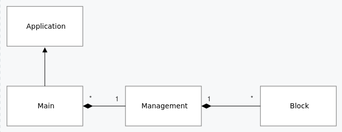
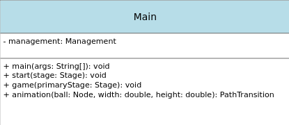
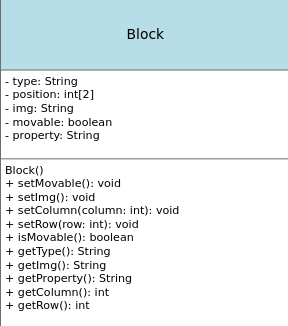
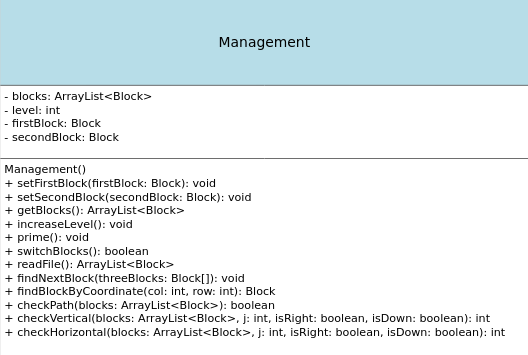
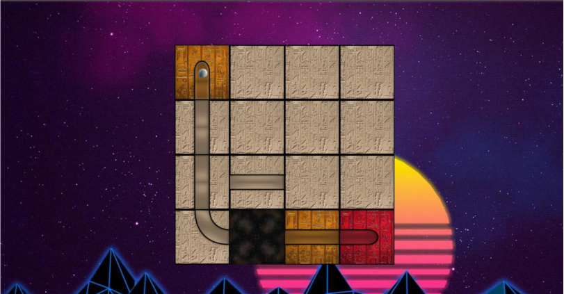
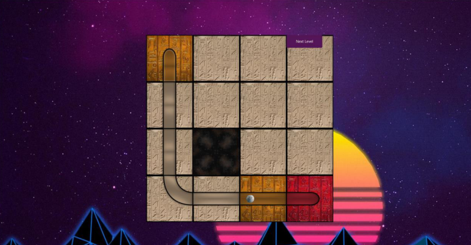
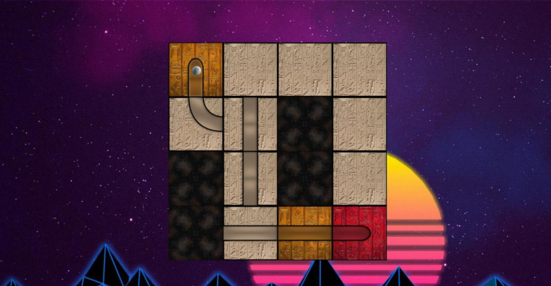
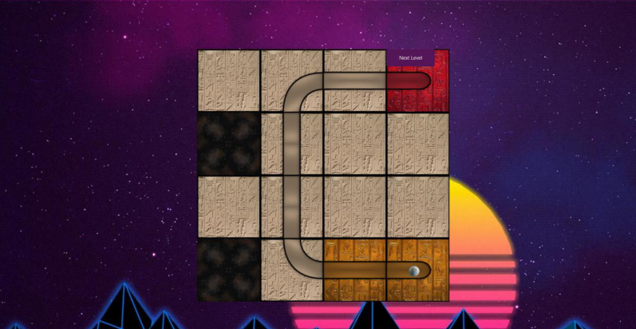

#  Problem Defination

The game is a puzzle game consisting of 4x4 blocks. If the blocks are lined up in the correct order, the ball starts to move and the level is completed. 

Blocks have different properties free, horizontal, vertical, 00,01,10,11 or static. The movements of the ball must be determined according to the characteristics of each block. This creates too many possibilities and all of them need to be handled of otherwise the game will not work as expected in some levels.

# Class Relationships

# Implementation Details

## Main

### Variables
- management: object of Management class

### Methods
- main: launch the javafx.
- start: Show the starting page.
- game: it is the main game screen, catch the mouse event .
- animation: if the path is complete it will reflect the animation

## Block

### Variables:
- type: keeps the types of blocks.
- position: keeps the position of blocks(collum,row) in array.
- img: keeps the file path of the image.
- movable: if blocks can be move it is true, otherwise it is false.
- property: keeps the propertys of the blocks (e.g: Horizontal, 00, free).

### Methods 
- Setter and getter methods.

## Management

### Variables

- blocks: keeps the blocks in the correct order in arraylist.
- level: keeps played level.
- firstBlocks: keeps place order when replacing with blocks
- secondBlock: keeps place order when replacing with blocks

### Methods
- increaseLevel: increase the played level.
- prime: invoke the readFile method and exception handling.
- switchBlocks: Updating blocks position and blocks’s arraylist based on moves.
- readFile: reading file and creating objects according to level and add to the arraylist.
- findNextBlock: finds properties of blocks on path for animation.
- findBlockByCoordinate: find blocks according to the coordinate.
- checkPath: find starter and end blocks’s index and invoke the correct method for horizontal or vertical.
- checkVertical: check the correct vertical part of path.
- checkHorizontal: check the correct horizontal part of path.
- Getter and setter methods

# Test Cases

When the block in the 9th index comes to the right place, the chechPath method dynamically checks the blocks and starts the animation and next level button appears.

The path is completed somehow, but not in the correct order, in this case the animation does
not start.

In this case, the start block is above than the end block, so a different cortol must be made.